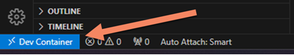

# Text-To-Text LLM Server

This repository is designed to be used with Visual Studio Code and Docker DevContainer.

**Instructions**:

a) Open in Visual Studio Code.

b) Click bottom left corner blue button.

c) Select "Reopen in Container"

e) Continue with the instructions in the [docs](./docs/gai-ttt-exllamav2.ipynb) folder.
